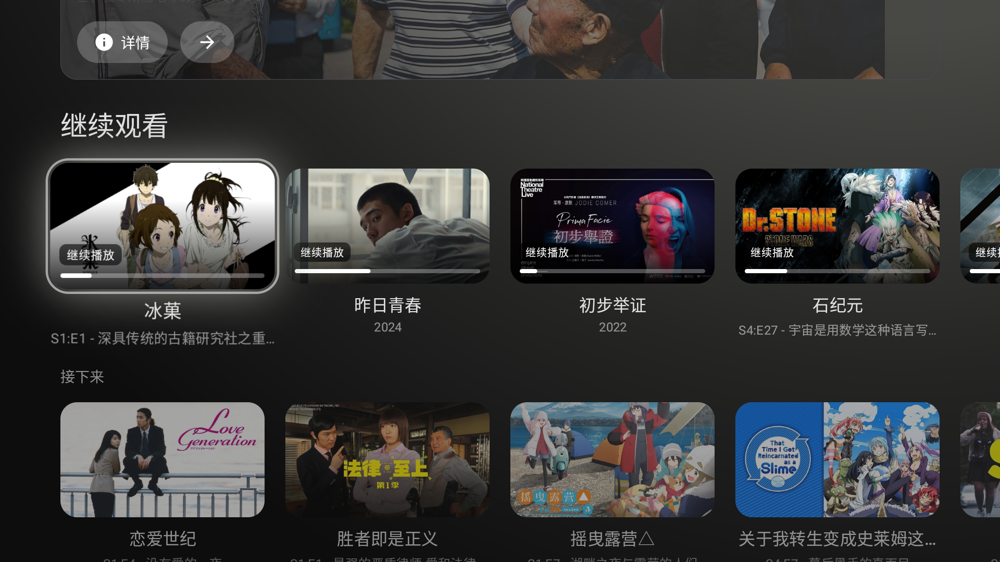
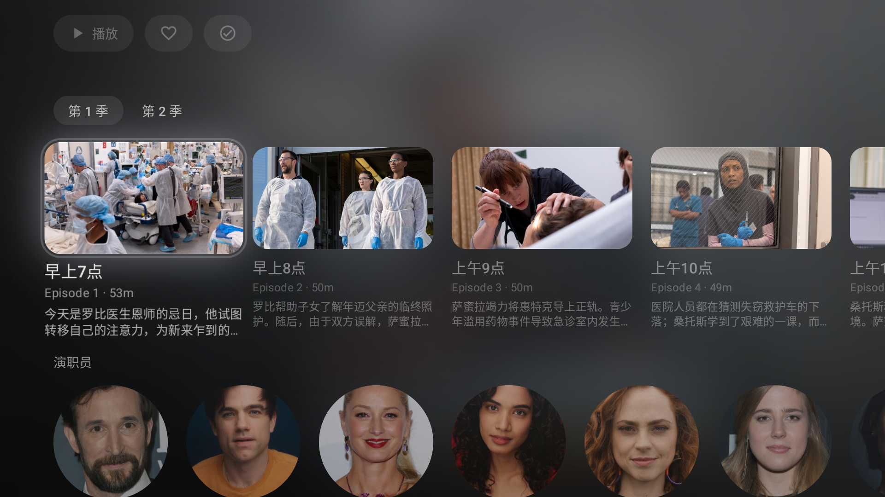
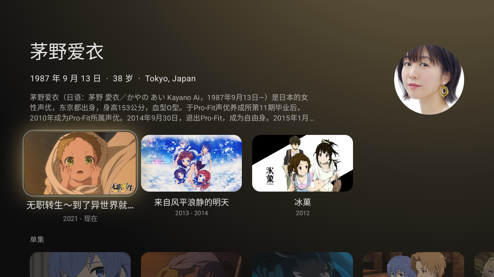

# Flow

**为 Android TV 打造的 Jellyfin / Emby 客户端**

[下载](../../releases/latest) · [讨论区](../../discussions) · [反馈 Bug](../../issues) · [激活码售后](https://github.com/Flow-Media-Client/Flow-After-sales/issues/new/choose)

---

## ✨ 特性

- **🎬 Emby/Jellyfin 支持** —— 同一个 App 同时连接 Jellyfin 和 Emby，多账号自由切换
- **📺 原生 TV 体验** —— 基于 Compose for TV 构建，D-pad 焦点流畅，遥控器友好，焦点控制符合直觉
- **⚡ 高性能播放** —— 使用 Media3， 支持 PGS / ASS 字幕、HDR、杜比（取决于设备）、多音轨。特效字幕支持优秀
- **💬 弹幕支持** —— 内置 dandanplay 弹幕源，兼容 dandanplay 协议，支持多源配置、自动匹配与手动搜索
- **⏭️ 跳过片头片尾** —— 内置服务器、introdb、theintrodb 三个片头片尾数据源，精准跳过片头片尾

## 📸 应用截图

  
   
  首页推荐

<table>
  <tr>
    <td width="50%" align="center">
      
       
      继续观看与媒体列表
    </td>
    <td width="50%" align="center">
      
       
      媒体详情页
    </td>
  </tr>
  <tr>
    <td width="50%" align="center">
      
       
      剧集与演职员信息
    </td>
    <td width="50%" align="center">
      
       
      人物详情页
    </td>
  </tr>
</table>

## 📥 下载安装

到 [Releases](../../releases/latest) 下载最新的 `app-release.apk`

> **系统要求**: Android 8.0 (API 26) 及以上,推荐 Android TV / Google TV 设备。

## 🚀 快速开始

1. 安装并打开 Flow
2. 首次启动会自动获取试用授权(无感,无需任何操作)
3. 添加你的媒体服务器:
   - **自动发现**: 同一局域网下会自动列出 Jellyfin 服务器
   - **手动添加**: 输入服务器地址(如 `http://192.168.1.10:8096`)
4. 登录账号即可开始

## 🔑 关于授权

Flow 使用 **licsign** 做离线授权,与 Jellyfin / Emby 登录完全独立:

- **激活** —— 试用过期后,在授权页输入激活码即可。支持手机扫码,在手机上输入激活码,免去用遥控器敲长串字符
- **重装恢复** —— 同一台设备重装后会自动恢复授权,无需重新输码

> 🛒 **购买激活码**:<https://pay.ldxp.cn/shop/ririsstore>(仅此一个官方渠道)
> 🆘 **激活码 / 订单 / 恢复相关售后**:[Flow-After-sales](https://github.com/Flow-Media-Client/Flow-After-sales/issues/new/choose)

## 🐛 反馈与交流

- **💬 想法、提问、经验分享** —— 请去 [Discussions](../../discussions)
- **🐞 Bug 报告** —— 请提 [Issue](../../issues/new),并附上:
  - Flow 版本号、设备型号、Android 版本
  - 媒体服务器类型与版本(Jellyfin / Emby)
  - 复现步骤、预期行为、实际行为
  - 必要时附日志或录屏
- **🆘 激活码 / 订单 / 授权恢复** —— 请到 [Flow-After-sales](https://github.com/Flow-Media-Client/Flow-After-sales/issues/new/choose) 走售后流程

## 📝 更新日志

每个版本的变更见对应 [Release Notes](../../releases)。

## ❓ FAQ

<b>支持 Plex / Kodi / 本地文件吗?</b>

目前只支持 Jellyfin 和 Emby。暂无支持其它后端的计划。

<b>弹幕从哪里来?需要付费吗?</b>

Flow 内置 dandanplay 兼容协议的客户端,你可以在设置里配置任意符合该协议的弹幕源(包括官方 dandanplay 公共 API、自建源、镜像)。Flow 本身不提供弹幕数据,也不收取任何弹幕相关费用。

<b>源码在哪里?</b>

Flow 目前不开源。这个仓库只用于发布二进制和接收社区反馈。

## 📜 License

Flow 是闭源软件。APK 仅用于个人非商业用途,禁止二次分发与逆向。
